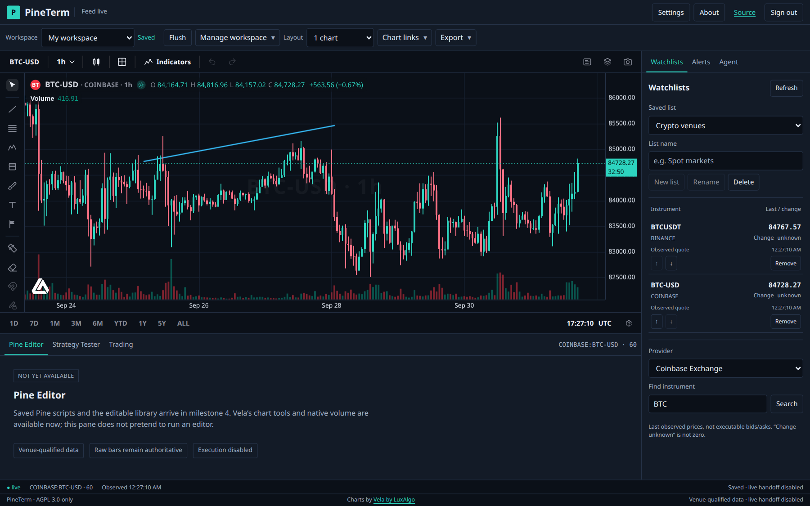

# PineTerm — your self-hosted charting and strategy workspace

An original, single-user crypto-first terminal built around [Vela](https://github.com/LuxAlgo/Vela), [PineTS](https://github.com/LuxAlgo/PineTS), and [Pi](https://github.com/earendil-works/pi). No TradingView affiliation, copied branding, or full-parity claim.



*Actual production application screenshot—not an image-generation concept or fabricated trading result.* [Mobile chart](design/screenshots/pineterm-mobile.png) · [mobile watchlist](design/screenshots/pineterm-mobile-watchlist.png).

## Readiness

Verified: administrator sessions/scoped keys; transactional SQLite persistence; Binance/Coinbase OHLCV, quotes and streaming; historical CSV import/export; Vela layouts/drawings/settings; named workspaces/watchlists; immutable Pine library, browser indicators and isolated reproducible strategy backtests; server-authoritative spot paper trading and isolated bar replay; durable price/Pine alerts with signed webhook outbox and restricted Telegram bot support; OpenAPI and production serving. External execution and Pi UI are subsequent milestones and **not available yet**. Telegram protocol/security behavior is verified, but no real bot credentials have been supplied. No prices, portfolio gains, or model answers are seeded.

### Market data

Venues stay distinct: `BINANCE:BTCUSDT` is USDT, `COINBASE:BTC-USD` is USD, and `CSV:<datasetId>` is imported historical data. No fallback from Binance `.com` to `.us` or between exchanges. Common intervals `1`, `5`, `15`, `60`, `D`; larger intervals include `3`, `30`, `45`, `120`, `240`, Monday-UTC weeks (`W`) and calendar months (`M`). Missing candles are gaps, never fabricated zero-volume rows.

Authenticated routes: `/api/v1/providers`, `/markets?provider=&q=`, `/bars?provider=&symbol=&timeframe=&from=&to=&limit=`, `/quotes?provider=&symbol=`, `/bars.csv`, and WebSocket `/stream`. Bar opens are epoch milliseconds; ranges are half-open `[from,to)`. Pages contain newest `limit` bars ascending (default 500, maximum 5000); continue with exclusive `to=nextBefore`. Responses expose live/stale/historical state, observation time and gaps. A provider failure is an error or explicit stale cache with `providerError`, not successful empty live history.

`POST /api/v1/datasets` accepts admin-session multipart: `name`, `baseCurrency`, `quoteCurrency`, `timeframe`, `tickSize`, `quantityStep`, and a CSV `file` (maximum 10 MiB). Exact header `time,open,high,low,close,volume`; UTC ISO-8601 `Z` or epoch milliseconds, not ambiguous seconds. Validation rejects duplicate timestamps, misalignment, invalid OHLC, nonfinite values or negative volume atomically. Imported feeds stay historical and cannot drive live execution. See OpenAPI for request/response schemas.

`npm run smoke:core -- --scenario data` exercises reversed fixture import, exact bars/ranges/pages/export, atomic failures, reference-counted authoritative close streaming and explicit stale failures. `PINETERM_SMOKE_URL=http://127.0.0.1:3100 npm run smoke:providers` exercised real authenticated Binance and Coinbase candles, successive forming-bar updates and fresh quotes. Supply `PINETERM_SMOKE_TOKEN` or a local admin password securely in the environment; any temporary read key created by the smoke is revoked afterward.

### Chart workspace

The original graphite/teal/rose React shell retains Vela’s chart chrome, drawing toolbar, object tree, undo/redo, scale/timezone settings and attribution. Choose `1`, `2h`, `2v`, `4` or `8` cells; linked crosshair, symbol, timeframe and viewport controls use Vela’s public workspace API. Styles include candles, OHLC bars, line, area, baseline and Heikin-Ashi. Synthetic display styles never replace raw backend candles for exports or future execution.

**Manage workspace** creates, renames, copies and deletes named server-backed documents. Saves are serialized, debounced and revision-guarded; **Flush** captures current chart state. Network failures retain a local draft. A conflicting revision offers explicit Reload or Save as copy, never silent overwrite. Unsupported/corrupt saved state remains available through **Download original state**. Watchlists keep ordered provider-qualified instruments; select a row to change the active chart, and use the displayed observation timestamp/freshness rather than assuming an executable price.

At tablet widths, right/bottom docks become exclusive keyboard-accessible drawers. At phone widths, one active chart fills the view while the saved multi-cell grid remains intact and returns on desktop. CSV export uses the backend’s half-open range rules. Vela PNG export includes chart/drawing raster but DOM overlays are best-effort and outer application docks are not included; product screenshots above capture the full browser.

Browser verification exercised real venue switching, trend-line drawing/persistence, `1 → 4 → 1` and eight-cell layouts, Heikin-Ashi, watchlist reordering, CSV/PNG downloads, historical CSV upload, mobile drawers/Escape, saved reload, and a real revision conflict with explicit recovery. Development and built production surfaces were both exercised. `npm run smoke:core -- --scenario workspace` exercises actual HTTP persistence/CAS/ordering; behavior tests also prove restart preservation.

**Image-reference prerequisite:** both session enablement and the subsequently requested global save of `generate_image.enabled` timed out unanswered in the configuration approval flow; the effective setting remained `false` from its default. No generated desktop/mobile reference images exist, and no SVG mockups were substituted. The implemented UI follows the approved textual layout/palette; screenshots are actual running-product images.

### Pine scripts and Strategy Tester

CodeMirror provides Pine text editing, line numbers and search—not a complete Pine language server. The original editable library includes SMA, EMA, RSI, MACD, Bollinger Bands, volume and an EMA-crossover strategy. Save creates immutable source/parameter revisions; rename/archive never erase prior job provenance. Import/export `.pine`; input controls use variable/declaration IDs, not ambiguous display titles. Explicit overrides take precedence over source settings, then runtime defaults.

**Add to chart** runs a browser preview in Vela’s per-cell PineWorkerEngine. Overlay/separate-pane, visibility/removal and workspace reload are supported through public Vela APIs. Browser workers provide responsiveness isolation, **not a security sandbox**: the pinned Blob worker needs CSP `unsafe-eval`. Script hosts remain restricted to `self`; do not run untrusted scripts merely because they use a worker. Browser previews may reflect synthetic chart styles and are never durable alert/order authority.

The server only executes Pine in nonroot Docker containers: network disabled, read-only root, no capabilities/host mounts/socket/secrets, 512 MiB, one CPU, 64 PIDs. Compilation is limited to 10 seconds; whole execution to 60 seconds; two concurrent slots, bounded queue, 50,000 total primary/secondary bars and 20 secondary series. Missing Docker/image returns `503 RUNNER_UNAVAILABLE`; there is no API-process execution fallback. Cancellation/deadline cleanup confirms termination before settling.

Backtests require an immutable saved strategy revision and an explicit UTC, aligned, half-open date range with complete confirmed raw candles. Gaps, missing confirmation, currency mismatch and excessive history reject instead of producing a shortened profit report. Results retain equity/drawdown, fills/fees, resolved settings, source/parameter/bar/metadata hashes and engine version. Export trades CSV; view fill markers and immutable provenance. Undefined metrics, including profit factor without losses, are `null`.

**Provider-locked MTF:** selected explicitly after proving PineTS 0.10.0 strips computed exchange prefixes before its public provider seam. All secondary data remains within the run/chart’s selected venue; computed prefixes cannot select another venue. Validation/results disclose this limitation. This is not TradingView namespace parity. Higher-timeframe data is clipped to the allowed close cursor; the fixture returned no 00:05 value at cursor 00:04, then 14 at 00:05.

PineTS also treats `currency.NONE` literally rather than resolving the instrument quote. Strategy currency must match quote currency exactly; USD is not USDT and no FX conversion is supplied. New strategy templates explicitly use the active quote currency, capital 10000, fixed quantity 1, commission 0.1%, slippage 0 and next-bar order processing. Existing/imported code retains its own settings.

`npm run smoke:core -- --scenario pine` exercised real Docker/HTTP execution: six-bar round trip entry 10 / exit 14, fees 2, final equity 1002; one-tick slippage entry 10.01 / exit 13.99, final 1001.98; capital override 2000 → final 2001.98. Paginated/unpaginated orders/trades/equity matched. SMA override, duplicate input titles, malformed source, no-future MTF, immutable revision/archive provenance, cancellation, API responsiveness and the actual 60-second timeout were exercised. [Actual Strategy Tester screenshot](design/screenshots/pineterm-backtest.png) uses the explicitly imported deterministic historical fixture—not portfolio gains.

### Paper trading and replay

Paper accounts hold one explicit quote currency with canonical decimal balances. No leverage, shorts, implicit USD/USDT conversion or real money. Set initial cash, commission (default 10 bps) and adverse slippage (default 0 bps) before creating an account. The ticket, reservations, cancellation, holdings/P/L, fills and cash ledger are server-owned and survive restart.

Live paper market orders wait for the first fresh observed quote **after** acceptance. Limits fill at-or-better; stops become market on crossing. Fees are charged separately, limit slippage is clamped at the limit, and unaffordable gaps reject rather than creating negative cash. Stale/disconnected feeds and CSV datasets cannot fill live paper. Reset requires explicit confirmation, archives the old audit ledger and creates a fresh account.

Authenticated API: `POST/GET /api/v1/paper/accounts`, `GET /paper/accounts/:id`, `POST /paper/orders` with `Idempotency-Key`, `POST /paper/orders/:id/cancel`, `GET /paper/orders`, `/paper/positions`, `/paper/fills`, and admin `POST /paper/accounts/:id/reset` with `{ "confirm": true }`. Reads require `paper:read`; placement/cancellation require `paper:trade`. Repeating an identical key/body returns the original order; conflicting reuse returns 409. See OpenAPI for full decimal-string request/response contracts.

**Bar replay** loads a complete confirmed window and creates a separate replay paper account. Start/step/Play/Pause/rewind/Stop use acknowledged server cursors; Play has one timer, not an independent chart clock. Native market/interval/layout switching is locked. Frozen chart tapes use the registered provider seam—not Vela’s offline-data mode, which synthesizes ticks. Workers receive only completed primary/secondary bars at the acknowledged cursor, including older-client requests; entry/rewind clears secondary caches and browser engines. Backtest fill markers are hidden during replay. Stop refreshes current live history; rewind archives the later replay ledger and starts a fresh account.

Replay market orders fill at the next raw-bar open. Limit/stop fills use deterministic OHLC gap rules, not an invented intrabar path; coarse-only datasets acknowledge at bar close and exclude orders accepted mid-bar. No OCO guarantee. Replay never sends live orders or notifications; separately armed server live alerts continue. Historical CSV is replayable, not a live venue.

`npm run smoke:core -- --scenario paper` exercised actual HTTP buy 2 @ 10 → cash 980, sell 1 @ 12 → cash 992/holding 1/realized P/L 2, idempotency, stale waiting, cancellation and restart preservation. `--scenario replay` proved next-open fills, unchanged live ledger, fresh-account rewind, stopped-session rejection, and 5-minute value absent at 00:04 → 14 at 00:05. Behavior tests also exercise concurrent reservations, slippage/fees, unaffordable gaps and same-market live-quote isolation. Actual development/production browser checks exercised live paper buy/cancel, replay buy/step, rewind, Play/Pause, mixed 1m/5m no-future reveal, mobile ticket/Escape and return-to-live. The actual Pine worker’s `request.security(..., "5", close, lookahead=barmerge.lookahead_off)` returned `null` at cursor 00:04 and 14 at 00:05, matching the isolated runner. [Actual replay screenshot](design/screenshots/pineterm-replay.png) uses an explicitly imported historical fixture, not live portfolio gains.

### Durable alerts and notifications

**Alerts** creates server-owned price `above/below/crosses_above/crosses_below` and Pine `alert()` / exact named `alertcondition()` definitions. Choose an explicit live venue, interval, confirmed-close or price-only quote mode, `all/any` flat groups, and once/once-per-bar frequency. Pine/mixed groups share one immutable script revision plus varID input overrides; editing or archiving its library source never changes an armed definition. CSV/replay cannot arm live alerts.

First observation establishes a baseline without firing. Quote above/below fires on false→true only; crossings compare previous/current price. Once-per-bar emits at most one signal per definition revision/timeframe bucket, including scripts with multiple `alert.freq_all` occurrences. Pine evaluation uses the real isolated runner, fixed persisted warm-up (last 500 confirmed bars unless an earlier start is selected), and cursor-clipped primary/secondary history. Warm-up never delivers; reaching compute/history limits pauses with an actionable reason.

Definitions, watermarks, crossing state, signal IDs and delivery rows survive restart. Outage recovery rebuilds current state and records missed intervals without stale catch-up notifications. Event plus outbox persistence is atomic. Pause/resume/re-arm/delete and labelled destination tests are explicit UI actions; deletion retains audit. Separately armed live alerts keep evaluating during chart replay. No destination means history only.

**Settings → Notifications** manages encrypted webhook signing secrets and a dedicated Telegram bot token. GET/API/browser storage never returns or persists these secrets. Webhooks require HTTPS, fresh DNS validation of public IPv4/IPv6 answers, a pinned destination per request, no redirects, bounded bodies and a ten-second delivery deadline. Private/loopback/link-local/metadata/reserved answers are rejected. `PINETERM_DEV_WEBHOOK_HOSTS=127.0.0.1` permits only an explicit exact development host for a local recording receiver; production refuses this setting.

Verify `X-PineTerm-Signature: sha256=<hex>` with HMAC-SHA256 over `X-PineTerm-Timestamp + "." + exact raw request bytes`. Payload includes stable `eventId`, `alertId`, `occurredAt`, venue-qualified `market`, `timeframe`, `message`, and optional `scriptRevisionId`. Delivery is **at-least-once**: interrupted sends may duplicate. Deduplicate by event ID. Durable states are pending/sending/delivered/failed; transient retries follow 5/30/120 seconds, with 429 Retry-After honored. Delivery history shows attempts/status/error; an HTTP 2xx alone is not receiver-side signature attestation.

Telegram uses fixed `api.telegram.org`, plain text ≤4096 characters, `getMe/getWebhookInfo` tests and persisted-offset `getUpdates` polling. Incoming `/status`, `/alerts`, `/positions` require both allowed chat **and** sender user IDs; `/pause_alerts` pauses notification delivery only, not evaluation or execution. No trading commands or model-generated Telegram actions. An existing webhook is an explicit dedicated-bot conflict; PineTerm never deletes it automatically. Global notification pause/resume is independent of alert evaluation.

Admin-session routes: `GET/POST /api/v1/alerts`, `GET/PUT/DELETE /alerts/:id`, `POST /alerts/:id/test`, `GET /alert-events?alertId=`, webhook CRUD/tests under `/webhooks`, Telegram configuration/test under `/integrations/telegram`, and notification-only pause under `/integrations/notifications`. Mutations require Origin/CSRF; scoped API keys cannot configure channels. Full contracts are in OpenAPI.

`npm run smoke:core -- --scenario alerts` exercised actual HTTP/browser-independent 10→12→13 crossing, event persistence before delivery/restart, stable IDs and actual-byte HMAC 500→200 retry, real Docker Pine `alert()`/named/mixed conditions without warm-up delivery, immutable-source changes, three missed outage intervals without stale dispatch, fresh recovery and labelled tests. Behavior checks cover mapped IPv6, mixed/rebound DNS, redirect rejection, retry exhaustion/429, late-ack deletion races, encrypted secrets and unauthorized Telegram commands. Production/development browser checks exercised price/Pine/group forms, varID overrides, archived-root preservation, pause/re-arm/history, signed local delivery, write-only secret clearing and mobile forms/Escape. [Actual alert screenshot](design/screenshots/pineterm-alerts.png) shows a labelled local-protocol test, not a live trading signal or real HTTPS receiver acceptance.


## Install and run

Requirements: Node 24, npm, Docker daemon for isolated Pine execution. Run the API on the host; do not expose a Docker socket to a web container.

```sh
npm ci
cp .env.example .env
chmod 600 .env
# Edit .env: choose PINETERM_ADMIN_PASSWORD and generate the two secrets below.
openssl rand -base64 48   # PINETERM_SESSION_SECRET
openssl rand -base64 32   # PINETERM_SECRET_KEY (AES-256-GCM)
npm run runner:build
npm run dev
```

Open `http://127.0.0.1:5173` and use your configured administrator password. The development API defaults to `127.0.0.1:3000`; Vite proxies `/api` and WebSockets without replacing the browser Origin. No default password or registration exists.

```sh
npm run build
npm start
```

Production serves the built browser application and API on `http://127.0.0.1:3000`. Set `NODE_ENV=production` to require built assets at startup. Behind HTTPS, set `PINETERM_PUBLIC_ORIGIN` to the exact external origin; sessions then use Secure cookies. Default bind is loopback, not a public interface.

| Setting | Meaning |
| --- | --- |
| `PINETERM_ADMIN_PASSWORD` | Required administrator password; startup scrypt hash, no stored plaintext database password. |
| `PINETERM_SESSION_SECRET` | Required signing/CSRF material, at least 32 random bytes. |
| `PINETERM_SECRET_KEY` | Required canonical base64 encoding of exactly 32 random bytes; encrypts integration secrets. Back it up securely. |
| `PINETERM_DATA_DIR` | Persistent database/integration/session directory; default `./data`. |
| `PINETERM_HOST`, `PINETERM_PORT` | Default `127.0.0.1`, `3000`. Vite follows a custom port. |
| `PINETERM_PUBLIC_ORIGIN` | Production default `http://127.0.0.1:3000`; dev launcher defaults to `http://127.0.0.1:5173` if omitted. |
| `PINETERM_SOURCE_REVISION` | Optional exact deployed 40-character Git revision for source attribution; startup otherwise discovers Git HEAD. |

If port 3000 is occupied, use `PINETERM_PORT=3100 npm run dev`; for production use `PINETERM_PORT=3100 PINETERM_PUBLIC_ORIGIN=http://127.0.0.1:3100 npm start`. Do not stop unrelated services. Changing encryption keys without retaining the original makes existing encrypted secrets unreadable.

## API and security

[OpenAPI](http://127.0.0.1:3000/api/v1/openapi.json) contains full implemented route schemas. Errors have `{error:{code,message,details?}}`. Unknown command properties are rejected, not silently removed.

Session routes: `POST /api/v1/session` with `{password}`, `GET /api/v1/session` with the signed session cookie, and `DELETE /api/v1/session`. Browser mutations require the configured `Origin` and current `x-csrf-token`. Login has persisted per-source and global attempt limits; sessions expire after twelve hours. Cookies are HttpOnly/SameSite=Strict; session IDs and API tokens are stored hashed.

Issue API keys in **Settings**. Copy a token during its one-time display; the server cannot retrieve it afterward. Bearer keys cannot create keys or change security policy. Available scopes: `market:read`, `scripts:read`, `backtests:run`, `paper:read`, `paper:trade`, `live:intent`, `executor:claim`, `executor:report`. Executor scopes require a server-owned executor binding; executor management is not yet implemented. Creating a scope does not activate a future capability.

Example for the currently available metadata API:

```sh
curl http://127.0.0.1:3000/api/v1/meta
curl http://127.0.0.1:3000/api/v1/openapi.json
```

`GET /api/v1/events` is an admin-session SSE stream of invalidation metadata only. Refetch authorized resources on reconnect. Database access stays in the server. SQLite uses WAL, foreign keys and numbered transactional migrations. Back up the data directory with SQLite-aware tooling; do not copy only a live database file while ignoring its WAL.

Keep `.env`, databases, agent logs, API/executor/model credentials and imported private data out of Git. The data directory is private by default. Do not put secrets in URLs or command-line arguments. Pi will have analysis/scripting authority only; future autonomous executor handoff requires a separately enabled policy.

## Verification

```sh
npm run typecheck
npm test
npm run build
npm run runner:build
npm run smoke:core
```

The core smoke starts real Fastify HTTP with temporary SQLite and injected deterministic providers, and launches the real restricted Docker runner. Scenarios exercise authentication/security, exact imports/ranges/streaming, workspace CAS/order persistence, Pine fills/costs/equity/provenance/cancellation/deadline isolation, paper accounting/restart, replay cursor/account isolation, and durable alerts/signed local delivery. The complete smoke and behavior suite passed after integration. Actual development/production browser checks cover charts, saved reload, editor/Strategy Tester, paper/replay, alert forms/history and notification settings; screenshots are running-product evidence, not generated concepts.

## Integrations and simulation limits

Real Telegram bot/chat/user authorization, an operator-controlled HTTPS webhook receiver, model/provider credentials, and an operator-supplied sandbox execution driver are not configured. Notification configuration is implemented through Settings; no real-money order is part of verification. `PINETERM_SMOKE_URL=http://127.0.0.1:3200 npm run smoke:integrations` exercised explicit unconfigured Telegram/HTTPS prerequisites and exited nonzero, rather than fabricating acceptance.

`npm run smoke:integrations -- --telegram` requires an admin password securely in `PINETERM_SMOKE_ADMIN_PASSWORD` (or local `.env`). It checks real bot identity/outgoing test, then waits up to 120 seconds for the operator to send `/status` from an allowed chat/user and observe server acknowledgement. `--webhook` requires a configured HTTPS destination (`PINETERM_SMOKE_WEBHOOK_ID` if multiple) plus `PINETERM_SMOKE_WEBHOOK_RECEIPT_URL`: the operator-owned HTTPS endpoint receives `?eventId=...` and returns `{eventId,signatureVerified:true,receivedAt}` only after validating the original timestamp/raw-body HMAC. Optional receipt bearer token uses `PINETERM_SMOKE_RECEIPT_TOKEN`, never URL credentials. No flags requests both channels. A missing prerequisite or failed requested check exits nonzero. For dev, use the Vite origin or set `PINETERM_SMOKE_ORIGIN` to the configured Origin.

PineTS simulations are not TradingView-identical execution: upstream documents OCA sibling differences, approximate liquidation, absent FX conversion and numerical differences. Historical imports remain historical. USD and USDT, and different exchange venues, are distinct markets. Feed errors are reported, never silently replaced by another venue.

## License and attribution

Original PineTerm code: **AGPL-3.0-only**, see [LICENSE](LICENSE). [Corresponding source](https://github.com/KNN-07/PineTerm) is public; About links the deployed revision when available. Network deployments must satisfy AGPL source obligations.

Pinned dependencies: `@luxalgo/vela@0.8.0` (Apache-2.0), `@luxalgo/vela-pinets@0.2.14` and `pinets@0.10.0` (AGPL-3.0-only), `@earendil-works/pi-coding-agent@0.99.2` and `@earendil-works/pi-ai@0.99.2` (MIT). Preserve [Vela LICENSE](licenses/vela-LICENSE) and [NOTICE](licenses/vela-NOTICE); visible Vela attribution is required on chart screens. These dependencies confer no Vela Pro or LuxAlgo paid script-library rights. Their upstream authors retain ownership; PineTerm does not copy chart/runtime forks.
