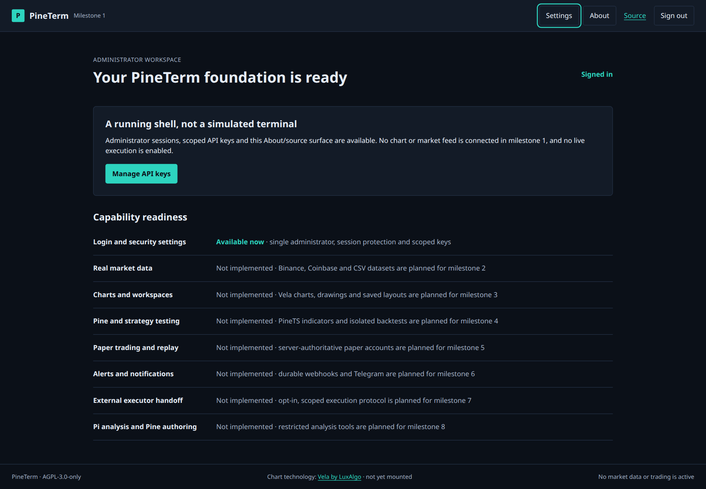

# PineTerm — your self-hosted charting and strategy workspace

An original, single-user crypto-first terminal built around [Vela](https://github.com/LuxAlgo/Vela), [PineTS](https://github.com/LuxAlgo/PineTS), and [Pi](https://github.com/earendil-works/pi). No TradingView affiliation, copied branding, or full-parity claim.



*Actual production application screenshot, milestone 1—not an image-generation concept or fabricated trading result.* [Mobile screenshot](design/screenshots/milestone-1-mobile.png).

## Readiness

The current verified milestone provides administrator login, protected sessions, scoped API-key management, durable SQLite migrations, authenticated invalidation events, OpenAPI, production web serving, and a nonroot isolated PineTS process. Charts, market feeds, saved chart workspaces, script/backtest services, paper trading/replay, alerts, external execution and Pi UI are subsequent build milestones; they are **not available yet**. No market prices, portfolio gains, or model answers are seeded.

## Install and run

Requirements: Node 24, npm, Docker daemon for isolated Pine execution. Run the API on the host; do not expose a Docker socket to a web container.

```sh
npm ci
cp .env.example .env
chmod 600 .env
# Edit .env: choose PINETERM_ADMIN_PASSWORD and generate the two secrets below.
openssl rand -base64 48   # PINETERM_SESSION_SECRET
openssl rand -base64 32   # PINETERM_SECRET_KEY (AES-256-GCM)
npm run runner:build
npm run dev
```

Open `http://127.0.0.1:5173` and use your configured administrator password. The development API defaults to `127.0.0.1:3000`; Vite proxies `/api` and WebSockets without replacing the browser Origin. No default password or registration exists.

```sh
npm run build
npm start
```

Production serves the built browser application and API on `http://127.0.0.1:3000`. Set `NODE_ENV=production` to require built assets at startup. Behind HTTPS, set `PINETERM_PUBLIC_ORIGIN` to the exact external origin; sessions then use Secure cookies. Default bind is loopback, not a public interface.

| Setting | Meaning |
| --- | --- |
| `PINETERM_ADMIN_PASSWORD` | Required administrator password; startup scrypt hash, no stored plaintext database password. |
| `PINETERM_SESSION_SECRET` | Required signing/CSRF material, at least 32 random bytes. |
| `PINETERM_SECRET_KEY` | Required canonical base64 encoding of exactly 32 random bytes; encrypts integration secrets. Back it up securely. |
| `PINETERM_DATA_DIR` | Persistent database/integration/session directory; default `./data`. |
| `PINETERM_HOST`, `PINETERM_PORT` | Default `127.0.0.1`, `3000`. Vite follows a custom port. |
| `PINETERM_PUBLIC_ORIGIN` | Production default `http://127.0.0.1:3000`; dev launcher defaults to `http://127.0.0.1:5173` if omitted. |
| `PINETERM_SOURCE_REVISION` | Optional exact deployed 40-character Git revision for source attribution; startup otherwise discovers Git HEAD. |

If port 3000 is occupied, use `PINETERM_PORT=3100 npm run dev`; for production use `PINETERM_PORT=3100 PINETERM_PUBLIC_ORIGIN=http://127.0.0.1:3100 npm start`. Do not stop unrelated services. Changing encryption keys without retaining the original makes existing encrypted secrets unreadable.

## API and security

[OpenAPI](http://127.0.0.1:3000/api/v1/openapi.json) contains full implemented route schemas. Errors have `{error:{code,message,details?}}`. Unknown command properties are rejected, not silently removed.

Session routes: `POST /api/v1/session` with `{password}`, `GET /api/v1/session` with the signed session cookie, and `DELETE /api/v1/session`. Browser mutations require the configured `Origin` and current `x-csrf-token`. Login has persisted per-source and global attempt limits; sessions expire after twelve hours. Cookies are HttpOnly/SameSite=Strict; session IDs and API tokens are stored hashed.

Issue API keys in **Settings**. Copy a token during its one-time display; the server cannot retrieve it afterward. Bearer keys cannot create keys or change security policy. Available scopes: `market:read`, `scripts:read`, `backtests:run`, `paper:read`, `paper:trade`, `live:intent`, `executor:claim`, `executor:report`. Executor scopes require a server-owned executor binding; executor management is not yet implemented. Creating a scope does not activate a future capability.

Example for the currently available metadata API:

```sh
curl http://127.0.0.1:3000/api/v1/meta
curl http://127.0.0.1:3000/api/v1/openapi.json
```

`GET /api/v1/events` is an admin-session SSE stream of invalidation metadata only. Refetch authorized resources on reconnect. Database access stays in the server. SQLite uses WAL, foreign keys and numbered transactional migrations. Back up the data directory with SQLite-aware tooling; do not copy only a live database file while ignoring its WAL.

Keep `.env`, databases, agent logs, API/executor/model credentials and imported private data out of Git. The data directory is private by default. Do not put secrets in URLs or command-line arguments. Pi will have analysis/scripting authority only; future autonomous executor handoff requires a separately enabled policy.

## Verification

```sh
npm run typecheck
npm test
npm run build
npm run runner:build
npm run smoke:core
```

The core smoke starts real Fastify HTTP on an ephemeral port and a temporary database; exercises login, foreign Origin/CSRF rejection, scoped token creation/revocation, and logout; launches the pinned PineTS Docker process without network, writable root, capabilities, mounts or secrets. Behavior tests cover authorization escalation, schema rejection and exact decimal arithmetic. Browser login/settings/About/reload were exercised in development and production at desktop/mobile sizes. The runner executed a Pine v6 `plot(close)` script from supplied bars and returned the actual values 10 and 12. This is not yet end-to-end backtest acceptance.

## Integrations and simulation limits

Telegram bot/chat/user authorization, HTTPS webhook receiver, model/provider credentials, and an operator-supplied sandbox execution driver are not configured. Configure these through the application when their corresponding milestone is available; never submit secrets in issues or chat. No real-money order is part of verification.

PineTS simulations are not TradingView-identical execution: upstream documents OCA sibling differences, approximate liquidation, absent FX conversion and numerical differences. Historical imports must remain historical. USD and USDT, and different exchange venues, are distinct markets. Future feed errors will be reported, not silently replaced by another venue.

## License and attribution

Original PineTerm code: **AGPL-3.0-only**, see [LICENSE](LICENSE). [Corresponding source](https://github.com/KNN-07/PineTerm) is public; About links the deployed revision when available. Network deployments must satisfy AGPL source obligations.

Pinned dependencies: `@luxalgo/vela@0.8.0` (Apache-2.0), `@luxalgo/vela-pinets@0.2.14` and `pinets@0.10.0` (AGPL-3.0-only), `@earendil-works/pi-coding-agent@0.99.2` and `@earendil-works/pi-ai@0.99.2` (MIT). Preserve [Vela LICENSE](licenses/vela-LICENSE) and [NOTICE](licenses/vela-NOTICE); visible Vela attribution is required on chart screens. These dependencies confer no Vela Pro or LuxAlgo paid script-library rights. Their upstream authors retain ownership; PineTerm does not copy chart/runtime forks.
